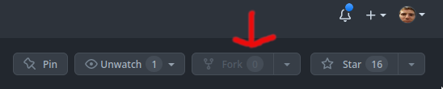

# Dokumentationa

### Inhaltsverzeichnis

- [Dokumentation - Vocabulary Webapplication](#dokumentation---vocabulary-webapplication)
  - [Inhaltsverzeichnis](#inhaltsverzeichnis)
  - [IPERKA](#iperka)
    - [Informieren](#informieren)
    - [Planen](#planen)
    - [Entscheiden](#entscheiden)
    - [Realisieren](#realisieren)
    - [Kontrollieren](#kontrollieren)
    - [Auswerten](#auswerten)
  - [Einleitung](#einleitung)
  - [Technologien](#technologien)
  - [Quellen](#quellen)
  - [Lokale Entwicklungsumgebung](#lokale-entwicklungsumgebung)
    - [Lokale Entwicklungsumgebung aufsetzen](#lokale-entwicklungsumgebung-aufsetzen)
    - [Vorbereiten](#vorbereitung)
    - [Dependencies mit NPM installieren](#dependencies-mit-npm-installieren)
    - [Lokale Server starten](#lokale-server-starten)
    - [Frontend starten](#frontend-starten)
    - [Optional: Backend starten](#optional:-backend-starten)
  - [Anforderungen](#anforderungen)
  - [Arbeitspakete](#arbeitspakete)
  - [Ausführung](#ausführung)
  - [Testen](#testen)
    - [Testumgebungen](#testumgebungen)
  - [Testfälle](#testfälle)
    - [Testprotokoll](#testprotokoll)
    - [Testbericht](#testbericht)
  - [Projektauswertung](#projektauswertung)

## IPERKA

### Informieren

- [Einleitung](#einleitung)
- [Technologien](#technologien)
- [Quellen](#quellen)
- [Anforderungen](#anforderungen)

### Planen

- [Testfälle](#testfälle)
- [Arbeitspakete](#arbeitspakete)

### Entscheiden

- [Technologien](#technologien)

### Realisieren

- [Ausführung](#ausführung)

### Kontrollieren

- [Testfälle](#testfälle)
- [Tesprotokoll](#testprotokoll)
- [Testbericht](#testbericht)

### Auswerten

- [Projektauswertung](#projektauswertung)

## Einleitung

Für dieses Projekt haben wir uns dafür entschieden, dass wir eine kleine Applikation releasieren, bei der man vokabeln in verschiedenen Sprachen lernen kann. Dabei kann man auch eigene Lernsets erstellen, verändern und löschen.

Die Seite ist unter folgender Adresse erreichbar:

[https://vocabulary.sanqro.me/](https://vocabulary.sanqro.me/)

## Technologien

Um unsere Vocabulary Webapplication zu realisieren haben wir uns dazu entschieden die folgenden Technologien zu verwenden:

- [NodeJS](https://nodejjs.org/en/about/)
- [Express](https://expressjs.com/de/)
- [React](https://reactjs.org)
- [TypeScript(tsx)](https://www.typescriptlang.org)
- [Deta](https://www.deta.space/)
- [Github mit Workflows](https://docs.github.com/en/actions/using-workflows)
- [Netlify](https://www.netlify.com/)

## Quellen

- [Deta Dokumenation](https://deta.space/docs/en/introduction/start)
- [Starter template for a Deta project using Node, Express and Typescript](https://github.com/BogDAAAMN/deta-typescript-express-starter)
- [Chat App](https://github.com/sanqro/chat) (Teilweise Logik und Middleware von diesem Projekt)
- [Deta Dokumentation zur Migration](https://deta.space/migration/guides/migrate-a-micro#modifying-your-source-code)
- [Typescript Hooks erklärt](https://www.youtube.com/watch?v=TNhaISOUy6Q)
- [Arrays mappen erklärt](https://www.youtube.com/watch?v=GmuSz6wGW2E)
- [Typescript Crash Course](https://www.youtube.com/watch?v=kq6IhAZVNh8)

## Lokale Entwicklungsumgebung

### Lokale Entwicklungsumgebung aufsetzen

### Vorbereitung

Für die Realisierung dieses Projekts haben wir Visual Studio Code mit wenigen Erweiterungen, und zwar ESLint, Prettier und Live Share verwendet. Bei der Live Share-Erweiterung haben wir keine speziellen Einstellungen vorgenommen, wobei wir bei den Erweiterungen ESLint und Prettier eine eigene Konfiguration erstellt haben, um unsere eigenen Code-Konventionen zu erzwingen. Diese Einstellungen werden automatisch übernommen, insofern man die beiden Erweiterung installiert hat und die Entwicklungsumgebung aufgesetzt hat.

Um die lokale Entwicklungsumgebung aufzusetzen, muss man sich zuerst eine Kopie vom Repository, von der [offiziellen Quelle](https://github.com/sanqro/vocabulary) holen.

Dies kann man tun, indem man eine eigene Kopie von dem Repository erstellt (forkt), damit man später seine Änderungen auch bei GitHub pushen kann, auch wenn man kein Contributor ist.

_Dadurch kann man auch die eigenen Änderungen im offiziellen Repository eingbringen, indem man eine Pull Request erstellt._



Wenn das Repository erfolgreich geforkt wurde, muss man das Repository klonen und in dessen Verzeichnis wechseln.

```shell
git clone https://github.com/[deinBenutzername]/vocabulary.git
cd vocabulary/
```

### Dependencies mit NPM installieren

**_Für diesen Schritt ist es notwendig, die node.js-Runtime installiert zu haben. [Download von node.js](https://nodejs.org/de/)_**

Nachdem man das Projekt geklont hat, sollte man alle Dependencies installieren. Dabei muss man in das entsprechende Verzeichnis wechseln und die Abhängigkeiten installieren.

**Dependencies im Frontend installieren**

```bash
cd client/
npm i
cd ..
```

_Nun sollten alle Dependencies installiert worden sein und es sollte eine Fehlermeldung erscheinen, dass es sechs verheerende Sicherheitslücken gibt. Diese sind jedoch momentan zu vernächlässigen, da es zu diesem Zeitpunkt noch keine Lösung für diese gibt **[Stand: März 2023]**._

**Optional: Dependencies im Backend installieren**

**_Dieser Schritt ist optional, da das Projekt im Frontend ein externes Backend verwendet, welches auf [deta.space ](https://deta.space)gehostet wird_**

```bash
cd server/
npm i
cd ..
```

### Lokale Server starten

### Frontend starten

Damit das Frontend lokal auf **localhost:3000** gestartet wird, muss der folgende Befehl in dem Verzeichnis des Frontends (client/) ausgeführt werden.

```bash
npm run start
```

### Optional: Backend starten

_Dieser Schritt ist optional, da das Projekt im Frontend ein externes Backend verwendet, welches auf [deta.space ](https://deta.space)gehostet wird_

_Damit das Backend ordnungsgemäss funktioniert müssen noch Umgebungsvariabelen angelegt werden, dafür muss man eine Datei im server/src Verzeichnis mit dem Namen .env anlegen_

**DETA_PROJECT_KEY:** Projektschlüssel von Deta.space.

**\JWT_Secret**: Zufällige Zeichenkette, je länger desto besser

_Optional: **PORT**: Eine Nummer, beispielsweise 3001, die den Port angibt auf, welchem das Backend gestartet wird._

Damit das Backend lokal auf **localhost:8080** (sofern die PORT-Variabel nicht gesetzt wurde) gestartet wird, muss der folgende Befehl in dem Verzeichnis des Backends (server/) ausgeführt werden.

```bash
npm run dev
```

## Anforderungen

| Anf.-Nr. | Muss/<br />Kann | funk./<br />qual. | Beschreibung |
| :------- | :-------------- | ----------------- | ------------ |
| 1        |                 |                   |              |

## Arbeitspakete

> 1x Arbeitspaket = 45 Minuten (eine Schullektion) <br />
> 1x Sitzung = 5x Arbeitspakete (ein Halbtag) <br />
> Arbeitspakete \* Sitzungen \* Gruppenmitglieder<br />
>
> 5 \* 6 \* 2 = 60 Arbeitpakete

| Nr. | Frist | Beschreibung | Zeit in Arbeitspaketen (geplant) |
| --- | ----- | ------------ | -------------------------------- |
| 1   |       |              |                                  |

## Ausführung

| Nr. | Frist | Bemerkung | Zeit (geplant) | Zeit (effektiv) |
| :-- | ----- | --------- | -------------- | --------------- |
| 1   |       |           |                |                 |

### Testumgebungen

Wir verwenden für die verschiedenen Testfälle zwei unterschiedliche Testumgebungen:

#### Selenium:

**Betriebssystem:**

Der Browser, mit dem wir die Tests in der Selenium-IDE ausführen, wird auf der neusten Version von Microsoft 10 (22H2) ausgeführt.

**Browser:**

Für den Browser verwenden wir die neuste Version von Mozilla Firefox (111.01).

**Selenium-IDE:**

Für die Tests mit Selenium verwenden wir die neuste Version der Selenium-IDE für Mozilla Firefox (3.17.4).
Postman:

#### Postman

**Betriebssystem:**

Die Postman-Applikation, mit der wir die Tests der API-Endpoints testen, wird auf der neusten Version von Microsoft 10 (22H2) ausgeführt.

**Postman:**

Die Postman-Applikation verwendet die neuste Version (v10.12).

#### Manuell (Per Hand):

**Betriebssystem:**

Der Browser, mit dem wir die Tests in dem wir die Tests manuell testen, wird auf der neusten Version von Microsoft 10 (22H2) ausgeführt.

**Browser:**

Für den Browser verwenden wir die neuste Version von Mozilla Firefox (111.01).

## Testfälle

| Testf.-Nr. | Anforderung | Vorraussetzung | Testumgebung | Eingabe | Erw. Ausgabe |
| :--------: | ----------- | :------------- | ------------ | ------- | ------------ |
|    1.1     | 1           |                |              | 1.      | 2.           |

### Testprotokoll

OK = Dieser Testfall wurde erfolgreich getestet.

NOK = Dieses Testfall konnte nicht (erfolgreich) getestet werden.

| Test-Nr | Bericht | Tester            |
| :------ | :------ | :---------------- |
| 1.1     | OK      | @sanqro, @RelxOff |

### Testbericht

Es müssen noch einige Anforderungen fertig implementiert werden, bevor das Programm abgegeben werden kann.

## Projektauswertung

Am Anfang des Projektes haben wir etwas länger für das Informieren gebraucht, aber wir waren noch im Rahmen der geplanten Zeit. Für einen aus unserer Gruppe war Typescript neu, darum hat es am Anfang etwas länger gebraucht, aber als er einam das Grundprinzip verstanden hat ging es gut. Wir haben die Aufgaben so aufgeteilt, dass der Erfahrene zuerst das Backend macht und der Neue macht zuerst das Frontend. Als das Backend fertig war haben wir beide am Frontend gearbeitet und konnten uns so besser austauschen. Das Erstellen von der Dokumentation ging am Anfang sehr gut, da wir wussten was wir haben wollen und mit welcher Technologie, aber am Schluss ging es nicht so gut voran, da wir nicht so gut konzentriert waren und uns viel ablenken lassen habe.
